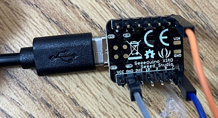
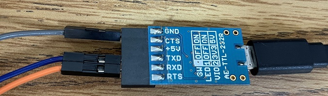
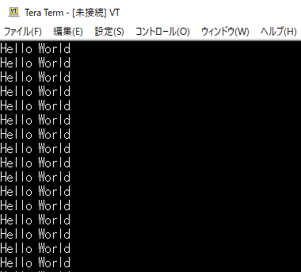

# seeeduino_xiao_serial

## 概要

SeeeduinoXiaoでシリアル通信するRustコードです。

## 準備

### ハードウェア

### ソフトウェア

* teratermでSeeduinoXiaoと接続されたシリアルポートを開き、以下の設定をします
    * シリアルポートオープン
    * 設定>シリアルポート設定>スピード:115200
    * 設定>端末>改行コード:AUTO

### 実行結果

